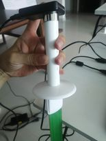

# TMS Datalogger instructions

## TMS4 general information

The TMS4 dataloggers offer the unique possibility to precisely measure air and soil temperature as well as soil moisture in the field. For more information about it's specifications, durability, price and installation visit the TOMST website: [https://tomst.com/web/en/systems/tms/tms-4/].

## Lolly software download and installation

TMS4 dataloggers use Lolly Manager software for optimal download of the data. To download and install Lolly manager follow the guide provided in TOMST website: [https://tomst.com/web/en/systems/tms/software/].

## Downloading data from datalogger to computer

Connect TOMST adapter to your computer by usb cable, put the adapter on top of the TMS4 datalogger and open Lolly Manager software.

Lolly Manager shows up the global time (UTC), PC time, percentage of battery remaining, used memory and mode of datalogger data uptake. At the bottom of the interface you can see a bar with the percentage of downloaded data.

## CSV data

After downloading the data to your computer yo can find the data in the folder `./Program files/Lolly/data`. There you will find three types of csv files, the one containing the temperature and soil moisture measurements will start with the word data, followed by the serial or id number of the datalogger and finally the number of file version.

The data csv contains the TMS4 datalogger measurements (temperature 1,2,3 and soil moisture) in columns. To check what each column represent visit the TOMST website: [https://tomst.com/web/en/systems/tms/software/]. 

